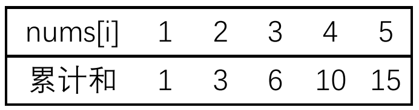

# S042.连续子数组的最大和

### 题目

【easy】输入一个整型数组，数组中的一个或连续多个整数组成一个子数组。求所有子数组的和的最大值。

要求时间复杂度为O(n)

<https://leetcode.cn/problems/lian-xu-zi-shu-zu-de-zui-da-he-lcof/>

### 方法一

【数学归纳法】容易想到，我们复用 nums，现在的 nums[i] 表示 "以 i 结尾的连续子数组的最大和"，那么状态转移方程为：

- ```nums[i] = nums[i - 1] + nums[i];```（```nums[i - 1] > 0```）
- ```nums[i] = nums[i];```（```nums[i - 1] <= 0```）

也就是：

- ```nums[i] = (nums[i - 1] > 0) ? nums[i - 1] + nums[i] : nums[i];```

遍历 nums 并维护一个最大值 res 即可

【时间复杂度】O(n)

【空间复杂度】O(1)

### 代码一

```cpp
// 数学归纳法
class Solution {
public:
    int maxSubArray(vector<int>& nums) {
        int n = nums.size();
        int res = nums[0];

        for (int i = 1; i < n; i++) {
            nums[i] = (nums[i - 1] > 0) ? nums[i - 1] + nums[i] : nums[i];
            if (nums[i] > res)
                res = nums[i];
        }
        return res;
    }
};
```

### 方法二

【累计和法】累计和法常被用来解决 “子路径” 的问题，在数组和二叉树中都有妙用。

累计和法的大致思路是：

- 从前到后计算 “累计和”
- 用 “累计和” 间接计算 ”同路径上的两节点之间的路径和“

如图：

<div style="text-align: center">

</div>

- ```num[i] == 2``` 的节点到 ```nums[i] == 5``` 的节点之间的路径和等于 ```15 - 3 = 12``` 
- ”同路径上的两节点之间的路径和“ 不包括起始节点

此题要我们求 “子数组和的最大值” ，该问题可以转化为：怎么求以 i 结尾的子数组和的最大值？如果采用累计和法：

- 我们需要知道此刻的累计和
- 也需要知道当前最小累计和（即 i 前方最小的累计和）
- 以 i 结尾的子数组和的最大值 = 此刻的累计和 - 当前最小累计和

于是，我们设置如下变量：

- 复用 nums：现在的 nums[i] 表示 "从 0 到 i 的累计和"
- 维护一个 res：表示返回结果
- 维护一个 currMin：表示当前最小的 nums[i]，用来计算 “以当前结点为结尾的子路径” 的最大路径和

那么以 i 结尾的子路径和的最大值为：

- ```iMax = nums[i] - currMin;```

注意：currMIn 的初始化应该是：```int currMin = (nums[0] < 0) ? nums[0] : 0;```

- 这是为了保证所有路径（也包括整条路径）都被计算在内

【时间复杂度】O(n)

【空间复杂度】O(1)

### 代码二

```cpp
class Solution {
public:
    int maxSubArray(vector<int>& nums) {
        int res = nums[0];
        int currMin = (nums[0] < 0) ? nums[0] : 0;
        int n = nums.size();

        for (int i = 1; i < n; i++) {
            nums[i] += nums[i - 1];
            int iMax = nums[i] - currMin;
            res = (iMax > res) ? iMax : res;
            currMin = (nums[i] < currMin) ? nums[i] : currMin;
        }
        return res;
    }
};
```


