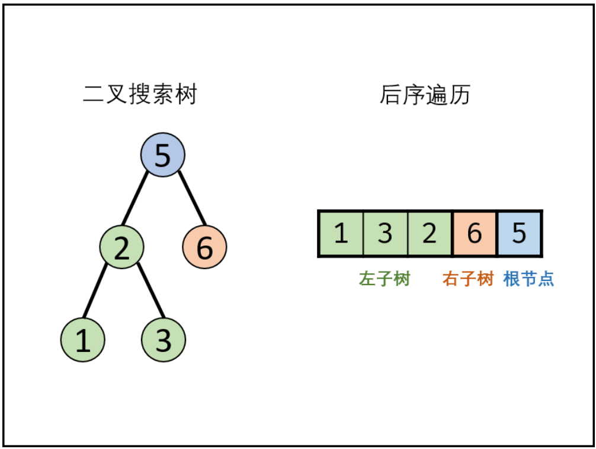

# S033.二叉搜索树的后续遍历序列

### 题目

【middle】输入一个整数数组，判断该数组是不是某二叉搜索树的后序遍历结果。如果是则返回 `true`，否则返回 `false`。假设输入的数组的任意两个数字都互不相同。

<https://leetcode.cn/problems/er-cha-sou-suo-shu-de-hou-xu-bian-li-xu-lie-lcof/>

### 方法

【递归分治】对于给出二叉树 前/中/后 序遍历结果，求原二叉树的题，我们都可以想到用分治的思路求解，如图：

<div style="text-align: center">

</div>

本题采用递归分治法，有两个要点：

- 后续遍历：也就是说遍历结果为 [ 左子树 | 右子树 | 根节点 ]
- 二叉搜索树：左子树所有节点 < 根节点，右子树所有节点 > 根节点

于是，我们的思路很简单 —— 对于每一次递归：

- 记录其根节点
- 划分出左子树，并与根节点比较大小
- 划分出右子树，并于根节点比较大小
- 递归验证左、右子树

分治的题，难点不在于思想，而在于对于 “边界” 这些细节的把控，在此题中，我们这样设计：

- 函数 ```bool isBinary_search_tree(int start, int end, vector<int>& postorder)```
  - 判断 ```[start, end]``` 序列是否为二叉搜索树
  - 当 ```start >= end``` 时，直接返回 true
- 划分左右子树
  - 以 ```postorder[end]``` 为根节点，遍历 ```[start, end]``` 找出第一个大于根节点的值，标记为 m
  - 左子树为 ```[start, m - 1]```（可能为空）
  - 右子树为 ```[m, end - 1]```（可能为空）
  - 根节点为 ```end```
- 验证左右子树
  - 左子树在前面遍历的过程中就已经判断了
  - 判断右子树
- 递归判断左右子树

【时间复杂度】O(n^2)

【空间复杂度】O(1)

### 代码

```cpp
class Solution {
public:
    bool isBinary_search_tree(int start, int end, const vector<int>& postorder) {
        if (start >= end)
            return true;
        // 划分左右子树
        int m = start;
        while (postorder[m] < postorder[end])
            m++;
        // 验证左右子树
        for (int temp = m; temp <= end - 1; temp++)
            if (postorder[temp] < postorder[end])
                return false;
        // 递归判断左右子树
        return isBinary_search_tree(start, m - 1, postorder) && isBinary_search_tree(m, end - 1, postorder);
    }
    bool verifyPostorder(vector<int>& postorder) {
        return isBinary_search_tree(0, postorder.size() - 1, postorder);
    }
};
```


