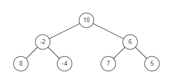
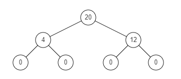

# KS2.将满二叉树转换为求和树

### 题目

【easy】【star】给出满二叉树的前序遍历结果和中序遍历结果，编写算法将其转化为求和树

什么是求和树：二叉树的求和树， 是一颗同样结构的二叉树，其树中的每个节点将包含原始树中的左子树和右子树的和。

二叉树：

<div style="text-align: center">

</div>

求和数：

<div style="text-align: center">

</div>


> 输入描述：2行整数，第1行表示二叉树的前序遍历，第2行表示二叉树的中序遍历，以空格分割
>
> 输出描述：1行整数，表示求和树的中序遍历，以空格分割
>
> ```
> 10 -2 8 -4 6 7 5
> 8 -2 -4 10 7 6 5
> ```
>
> ```
> 0 4 0 20 0 12 0
> ```

<https://www.nowcoder.com/practice/b31734e46ba644de85a9cf95bbd57a5f?tpId=182&tqId=34447&rp=1&ru=/exam/oj&qru=/exam/oj&sourceUrl=%2Fexam%2Foj%3Fpage%3D1%26tab%3D%25E5%2590%258D%25E4%25BC%2581%25E7%259C%259F%25E9%25A2%2598%26topicId%3D182&difficulty=undefined&judgeStatus=undefined&tags=&title=>

### 方法

由于知道了前序和中序遍历结果，我们想到可以还原这个二叉树，然后递归求和。

但是，此题并没有必要还原树。我们只需要对中序遍历结果进行递归求和即可，核心代码：

```cpp
int sumtree(int lb, int rb, const vector<int>& inorder) {
    int root = (lb + rb) / 2;
    if (lb == rb) {
        res[root] = 0;
        return inorder[lb];
    }
        
    int sumleft = sumtree(lb, root - 1, inorder);
    int sumright = sumtree(root + 1, rb, inorder);
    res[root] = sumleft + sumright;
    return res[root] + inorder[root];
}
```

- ```lb、rb```：```LeftBound、RightBound```
- 新节点的值只等于左右两树之和，不加根节点
- 返回值要加上新节点

【时间复杂度】O(n)

【空间复杂度】O(n)

### 代码

```cpp
#include <iostream>
#include <vector>
using namespace std;

vector<int> res;

int sumtree(int lb, int rb, const vector<int>& inorder) {
    int root = (lb + rb) / 2;
    if (lb == rb) {
        res[root] = 0;
        return inorder[lb];
    }
        
    int sumleft = sumtree(lb, root - 1, inorder);
    int sumright = sumtree(root + 1, rb, inorder);
    res[root] = sumleft + sumright;
    return inorder[root] + sumleft + sumright;
}

int main() {
    vector<int>* getin = new vector<int>();
    int temp;
    while (cin >> temp)
        getin->emplace_back(temp);
    int n = getin->size() / 2;
    vector<int> inorder(getin->begin() + n, getin->end());
    res.resize(n);
    delete getin;
    
    sumtree(0, n - 1, inorder);
    for (int i = 0; i < n; i++)
        cout << res[i] << " ";
    
    return 0;
}
```


