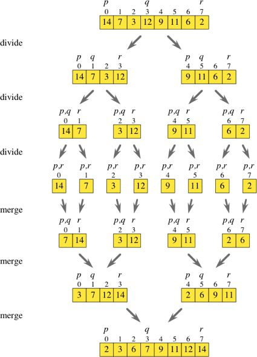

# 实现归并排序

[TOC]

### 原理

【分治法】将原问题分解为几个规模较小的子问题，递归地求解这些子问题，然后再合并解从而得到原问题的解。

把待排序数组从中间分割为两个子数组，这两个子数组分别排序，排完序后再把它们合并起来。

- 当子数组长度为 1 时，无需再分割
- 因为合并的是两个有序子数组，所以使用双指针简单插入排序即可

<div style="text-align: center">

</div>

### 基础实现

```cpp
#include <iostream>
using namespace std;
 
/* 合并 */
void merge(int arr[], int tempArr[], int left, int mid, int right) {
    int l_pos = left;						// 标记左半区第一个元素
    int r_pos = mid + 1;					// 标记右半区第一个元素
    int pos = left;							// 临时数组元素的下标
 
    while (l_pos <= mid && r_pos <= right) {// 有序归并
        if (arr[l_pos] < arr[r_pos])
            tempArr[pos++] = arr[l_pos++];
        else
            tempArr[pos++] = arr[r_pos++];
    }
    while (l_pos <= mid)
        tempArr[pos++] = arr[l_pos++];
    while (r_pos <= right)
        tempArr[pos++] = arr[r_pos++];
 
    while (left <= right) {					// 把临时数组中合并后的元素复制回原来的数组
        arr[left] = tempArr[left];
        left++;
    }
        
}
 
/* arr原数组，tempArr辅助数组，left左边界，right右边界 */
void merge_sort(int arr[], int tempArr[], int left, int right) {
    if (left == right)						// 若只有一个元素，不需要归并排序
        return;
 
    int mid = (left + right) / 2;			// 中间点
    merge_sort(arr, tempArr, left, mid);	// 对左半部分进行归并排序
    merge_sort(arr, tempArr, mid + 1, right);// 对右半部分进行归并排序
    merge(arr, tempArr, left, mid, right);	// 合并已经排序的部分
}
 
int main() {
    int N = 10;
    int TEST[] = {3,8,1,9,2,11,15,22,0,87};
    
    for (int i : TEST)
        cout << i << " ";
    cout << endl;
 
    int tempArr[N];
    merge_sort(TEST, tempArr, 0, N - 1);	// 对TEST归并排序
    
    for (int i : TEST)
        cout << i << " ";
    return 0;
}
```

### 使用单链表实现
```
#include <iostream>
#include <vector>
using namespace std;
 
 
struct Linklist {
    int val;
    Linklist* next;
    Linklist() {next = nullptr;}
    Linklist(int v) {val = v; next = nullptr;}
};
Linklist* link(vector<int> arr) {
    int n = arr.size();
    Linklist* head = new Linklist;
    Linklist* temp = head;
    for (int i = 0; i < n; i++) {
        temp->val = arr[i];
        if (i != n - 1) {
            temp->next = new Linklist;
            temp = temp->next;
        }
    }
    return head;
} 
void display(Linklist* head) {
    while (head) {
        cout << head->val << " ";
        head = head->next;
    }
    cout << endl;
}
Linklist* merge(Linklist* lhead, Linklist* rhead) {
    Linklist* head = new Linklist;
    Linklist* temp = head;
    Linklist* temp1 = lhead;
    Linklist* temp2 = rhead;
    while (temp1 && temp2) {
        if (temp1->val < temp2->val) {
            temp->next = temp1;
            temp1 = temp1->next;
        } else {
            temp->next = temp2;
            temp2 = temp2->next;
        }
        temp = temp->next;
    }
    if (temp1)
        temp->next = temp1;
    if (temp2)
        temp->next = temp2;
    return head->next;
}
Linklist* merge_sort(Linklist* head) {
    // 用快慢指针确定中点
    Linklist *quick, *slow;
    quick = slow = head;
    while (quick->next) {
        quick = quick->next;
        if (quick->next) {
            quick = quick->next;
            slow = slow->next;
        }
    }
    // 链表只有一个节点，直接返回
    if (quick == slow)
        return head;
    // 将链表切分为两段
    Linklist* lhead = head;
    Linklist* rhead = slow->next;
    slow->next = nullptr;
    lhead = merge_sort(lhead);
    rhead = merge_sort(rhead);
    head = merge(lhead, rhead);
    return head;
}
 
int main() {
    vector<int> arr = {3,8,1,9,2,11,15,22,0,87};
    Linklist* head = link(arr);
    head = merge_sort(head);
    display(head);
 
    return 0;
}
```
